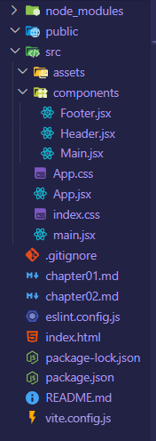

## Component

App.jsx 파일을 가면 App()이라는 함수가 HTML 태그를 리턴하는데 이렇게 **HTML 태그를 반환하는 함수**를 특별히 **component**라고 부른다.

```react
function Header(){
    return (
      <header>
        <h1>header</h1>
      </header>
    );
  }

// 이런게 component
```


- 이렇게 **함수로 만든 컴포넌트**를 리액트에서는 특별히 **함수 컴포넌트**라고 부른다.
- 클래스로 컴포넌트를 만드는 **클래스 컴포넌트**도 있다고 한다.

```react
const Header = () => {
    return (
      <header>
        <h1>header</h1>
      </header>
    );
  }
  
// 화살표 함수로 만들어도 된다.
```

---

##### 🤔 주의할 점

- 컴포넌트를 생성하는 함수 이름의 **첫 글자는 대문자**여야 한다.
  - 그렇지 않으면, 리액트는 내부적으로 <u>그 함수를 컴포넌트라고 인정해주지 않는다.</u>

---

```react
function App() {
  const Header = () => {
    return (
      <header>
        <h1>header</h1>  // 다른 컴포넌트의 리턴문 내부에 포함되는 컴포넌트를 '자식 컴포넌트'라고 함
      </header>
    );
  }

  return (
  <>
    <Header/>
    <h1>안녕 리액트</h1>
  </>
  );
}
```

### ✅ 계층 구조

- 위 코드의 **Header 컴포넌트**처럼 다른 컴포넌트의 리턴문 내부에 포함되는 컴포넌트를 `자식 컴포넌트`라고 한다.
- **App 컴포넌트**처럼 자식 컴포넌트를 가진 컴포넌트를 `부모 컴포넌트`라고 한다.


#### ✨ 리액트의 모든 컴포넌트들은 화면에 렌더링되기 위해서 App 컴포넌트의 자식 컴포넌트로서 존재해야 한다.

- 모든 리액트 컴포넌트들은 **App** 컴포넌트를 **최상위 조상으로 갖는 계층 구조**를 가지게 된다.
- 이때, **모든 컴포넌트들의 조상** 역할을 하는 **App** 컴포넌트를 특별히 모든 컴포넌트들의 **뿌리** 역할을 한다고 해서 `root component`라고 한다.
- **root component**는 결국 main.jsx라는 파일의 렌더 메서드의 인수로 전달된 컴포넌트이기 때문에 원하는대로 다른 컴포넌트를 루트로 변경할 수도 있다. **(관례상 root component는 App이라고 씀)**

---

#### ✨ 보통 리액트 컴포넌트들은 하나의 파일에 다 모아서 작성하기 보다는 모듈화를 위해서 컴포넌트별로 각각 파일을 나눠서 작성한다.

- App 컴포넌트를 제외한 **컴포넌트들을 모아두기 위한 폴더인 components**라는 폴더를 src에 만든다.

##### 📝 Header.jsx

```react
const Header = () => {
    return (
      <header>
        <h1>header</h1>  // 다른 컴포넌트의 리턴문 내부에 포함되는 컴포넌트를 '자식 컴포넌트'라고 함
      </header>
    );
  };

export default Header;  // 헤더 컴포넌트를 내보내주자
```

---


##### ✅ ES 모듈 시스템에 의해서 Header.jsx 파일에서 Header라는 함수 컴포넌트가 기본값으로 내보내지게 되니까 이제 app.jsx 파일에서 Header를 import한다.

```react
import './App.css'
import Header from "./components/Header.jsx";
import Main from "./components/Main";
import Footer from './components/Footer';

function App() {
  return (
  <>
    <Header/>
    <Main/>
    <Footer/>
  </>
  );
}

export default App
```

